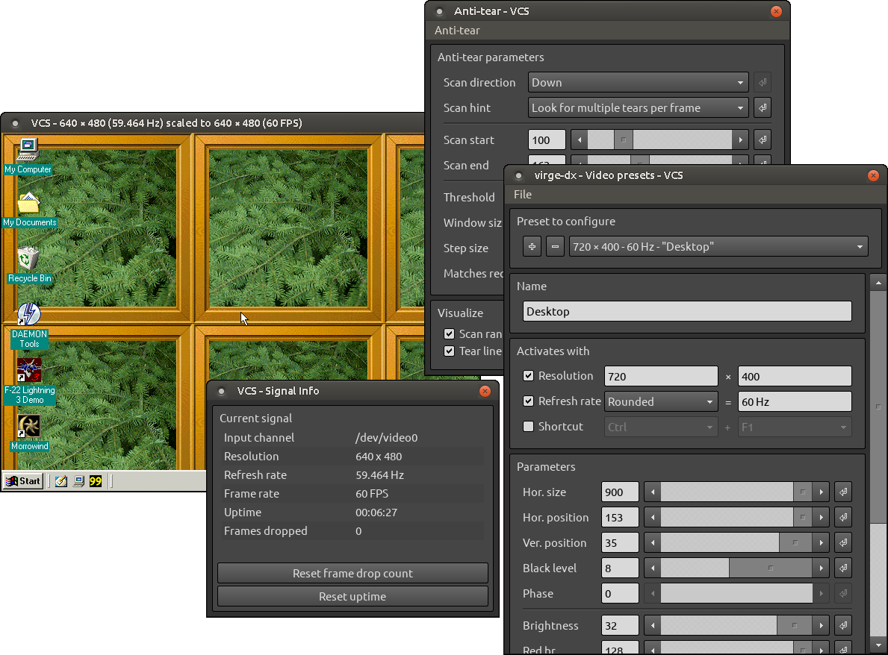

# Introduction to VCS

VCS is a third-party control application by [Tarpeeksi Hyvae Soft](https://www.tarpeeksihyvaesoft.com) for Datapath's VisionRGB range of capture hardware; developed especially for capturing retro PCs and consoles, whose dynamic, non-standard video signals aren't well supported by Datapath's default capture software.

VCS is [available on GitHub](https://github.com/leikareipa/vcs).

> A screenshot of VCS 2.4.0 showing the output window and some of the control dialogs\

## Program features

- Augments the capabilities of the VisionRGB hardware for capturing dynamic signals (e.g. retro PCs)
- Various feature and usability improvements over Datapath's default capture application
- Supports both modern and legacy VisionRGB hardware
- Runs on Windows (XP and later) and Linux (experimental)
- Unlimited video presets with automatic programmable activation
- Several scaling modes and customizable image filters
- Post-processing to reduce or eliminate tearing in captured frames
- On-screen display with HTML/CSS formatting
- Variable refresh rate output to match the input signal's frequency
- Low reliance on GPU features, easy to run in virtual machines
- Custom dark GUI theme
- Good documentation for both end-users and developers
- Modular code extendable to support capture hardware from other vendors
- Free and open source

## Supported capture hardware

<dokki-table headerless>
    <table>
        <tr>
            <th>Vendor</th>
            <th>Model</th>
        </tr>
        <tr>
            <td>Datapath</td>
            <td>VisionRGB-PRO1</td>
        </tr>
        <tr>
            <td>Datapath</td>
            <td>VisionRGB-PRO2</td>
        </tr>
        <tr>
            <td>Datapath</td>
            <td>VisionRGB-E1</td>
        </tr>
        <tr>
            <td>Datapath</td>
            <td>VisionRGB-E2</td>
        </tr>
        <tr>
            <td>Datapath</td>
            <td>VisionRGB-E1S</td>
        </tr>
        <tr>
            <td>Datapath</td>
            <td>VisionRGB-E2S</td>
        </tr>
        <tr>
            <td>Datapath</td>
            <td>VisionRGB-X2</td>
        </tr>
        <tr>
            <td>Datapath</td>
            <td>VisionAV series*</td>
        </tr>
        <tfoot>
            <tr>
                <td colspan="2">
                    *Can't be guaranteed, but user reports suggest compatibility.
                </td>
            </tr>
        </tfoot>
    </table>
</dokki-table>

## System requirements

<dokki-table headerless>
    <table>
        <tr>
            <th>OS</th>
            <td>
                <dokki-table headerless>
                    <table>
                        <tr>
                            <th>Platform</th>
                            <th>Required version</th>
                        </tr>
                        <tr>
                            <td>Windows</td>
                            <td>XP or later</td>
                        </tr>
                        <tr>
                            <td>Linux</td>
                            <td>Kernel 5</td>
                        </tr>
                    </table>
                </dokki-table>
            </td>
        </tr>
        <tr>
            <th>CPU</th>
            <td>
                <dokki-table headerless>
                    <table>
                        <tr>
                            <th>Capture resolution</th>
                            <th>Recommended performance level</th>
                        </tr>
                        <tr>
                            <td>VGA</td>
                            <td>Intel Sandy Bridge</td>
                        </tr>
                        <tr>
                            <td>1080p, 30 FPS</td>
                            <td>Intel Haswell</td>
                        </tr>
                        <tr>
                            <td>1080p, 60 FPS</td>
                            <td>Intel Coffee Lake</td>
                        </tr>
                    </table>
                </dokki-table>
            </td>
        </tr>
        <tr>
            <th>GPU</th>
            <td>
                For hardware rendering (optional), a graphics card with support for OpenGL 1.2
            </td>
        </tr>
        <tr>
            <th>RAM</th>
            <td>1 GB</td>
        </tr>
    </table>
</dokki-table>
